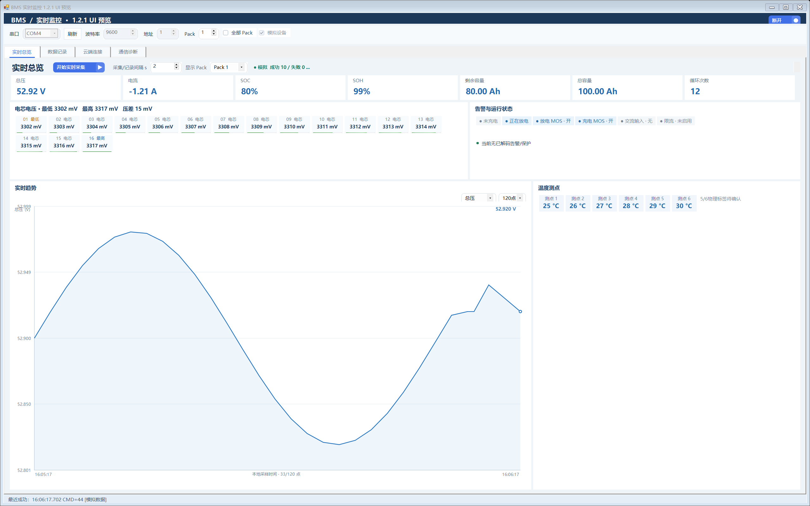
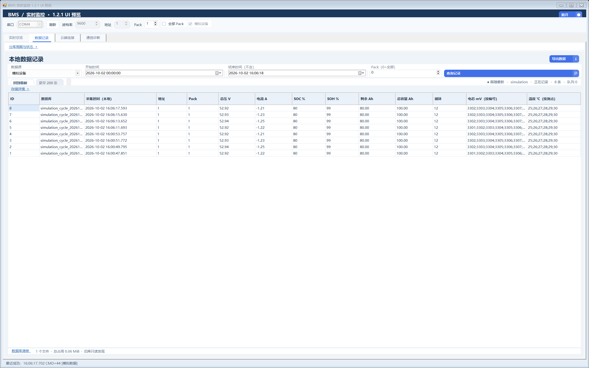

# BMS 实时监控（BmsRealtimeDemo）

一个独立的 Windows 桌面程序，通过串口读取电池管理系统（BMS）的实时数据，提供实时监控、本地数据记录、历史查询与 Excel/CSV 导出。

- 基于 **WinForms + .NET Framework 4.8**，用系统自带的 `csc.exe` 编译，SQLite 依赖随仓库提供，无需在线恢复 NuGet 包；
- 内置**模拟设备**，没有实机也能完整演示与自测；
- 数据落盘为 **SQLite**，支持按周期**分期分库**与流式导出。

> 当前版本：1.2.7。源码、构建脚本、云端模块与最新 Release 均以本目录为准；运行包由 GitHub Actions 从标签源码在干净 Windows Runner 上构建并发布。协议依据《串口通信协议 V1.1》，针对特定 BMS 设备。开发进度见 [CHANGELOG.md](CHANGELOG.md)。

## 界面预览

**实时总览** —— 总压/电流/SOC/SOH/容量/循环、逐电芯电压与压差、温度测点、告警与运行状态、实时趋势曲线：



**数据记录** —— 本地 SQLite 记录查询、分页浏览与导出：



## 功能特性

### 串口通信与实时监控
- 自定义协议组帧、校验和、半包/粘包重组；响应按设备地址匹配。
- 支持 42 实时数据、44 当前告警、4D 读取时间、E9 序列号，以及 47/4B/4C 原始响应。
- 实时总览展示总压、电流、SOC、SOH、剩余/总容量、循环次数、电芯电压（含压差）、温度测点、按 Pack 隔离的告警与运行状态（充放电、MOS、交流输入、限流）。
- 多 Pack：请求"全部 Pack"后可切换查看，每个 Pack 保留独立快照。
- 实时趋势为内存自绘曲线，可切换总压/电流/SOC，保留最近 120/300/600 点，横轴使用真实本地采样时间。
- 支持模拟设备离线演示；不自动重连、不自动写入设备参数。

### 本地数据记录
- 首次手动连接后开始记录，"采集/记录间隔"可设 1–86400 秒（默认 2 秒），重启后保留。
- **分期分库存储**：默认 30 天一个周期库，可选 7/15/30 天或自定义 1–3650 天；切库排空写队列，设备身份持久化，重启续写。
- 模拟与实机数据分库隔离，互不影响。
- 写入采用后台单线程 + 有界队列（1024 项 / 约 16 MiB 载荷，单事务最多 128 项）；磁盘低于 1 GiB 提示、低于 100 MiB 停止接收新记录，不静默丢样本。
- 停止轮询或断开后数值保留并明确标记过期；曲线数据不写入数据库。

### 查询与导出
- 按 时间 / Pack / 数据源 筛选、分页浏览历史记录；断开后也可直接打开已有数据库。
- 导出 **Excel (.xlsx)** 与 **CSV**：流式写出、大导出自动分卷（每表最多 100 000 行、每簿最多 200 000 行）、带进度与取消。
- 导出主表与告警附表保留采集时间、总压、电流、SOC/SOH、容量、循环、均衡与湿度等汇总列及原始 HEX；不含 ID、来源、地址、Pack 与逐电芯电压/逐温度列（这些明细仍完整保存在本地数据库中）。
- 导出文件名包含时间范围、来源、Pack 与分卷号，重复导出不覆盖旧文件。

### 云端连接（默认关闭）
- 可选云模块：HTTPS 上报、DPAPI 令牌保护、稳定设备编号、心跳/观看租约。
- 仅在有效观看租约内发送新鲜快照（最多缓存 16 个 Pack 最新值），不上传完整历史；无人观看只发心跳。
- 可对接正式云端实时页面；Win11 已由用户验证模拟及实机上传。Win10 校园网排查发现默认 DNS 超时，公共 DNS 可解析，后续需验证服务器连通和认证。
- .NET 4.8 强加密与系统默认 TLS；增加分阶段连接诊断、脱敏错误分类、限频轮转日志和跨电脑 DPAPI 令牌不可读提示。

### 通信诊断
- 单次读取与收发日志；原始逐帧日志默认关闭，启用后写入 `logs/`。
- 完整通信帧随记录保存到 SQLite；未处理异常会尝试输出 `logs/crash-*.log`。

## 环境要求

- Windows 10/11，需要 **.NET Framework 4.8 或兼容的更新版本**；部分 Win10 需另行安装运行时。
- 构建使用 .NET Framework 的 `csc.exe`，无需 Visual Studio。迁移必须一起携带 `BmsRealtimeDemo.exe.config` 和 SQLite 依赖。

## 构建与自检

在本目录（PowerShell）：

```powershell
# 编译并运行协议/界面自检，输出隔离在 .testing/stage2/
./build.ps1

# 回归自检
./run-self-test.ps1

# 生成迁移 ZIP（release/），附 SHA256 清单，不包含源码、日志和数据库
./package.ps1
```

仓库还提供 `.github/workflows/windows-release.yml`：推送 `main` 或 Pull Request 时由 GitHub `windows-latest` 运行同一套自检并生成短期 Actions Artifact；推送与 EXE 版本一致的 `vX.Y.Z` 标签时，会自动把完整 Windows 运行目录压成 ZIP 并上传到 GitHub Release。本地开发不再要求保留历史构建 ZIP。

当前构建通过 **283 项自检**，覆盖协议、记录、导出、分库、界面布局、云端请求/超时/取消/认证、5 分钟历史预热、TLS 配置和诊断脱敏。实际公网 TLS 1.2 严格证书校验通过；实验室 Win10 完整端到端仍待验证。

## 运行

双击 `BmsRealtimeDemo.exe`：

1. 默认**不勾选模拟设备**（实机模式，不会自动连接）；离线体验时手动勾选**模拟设备**再点击"连接"（旧版本保存的模拟勾选在启动时会被忽略，需每次手动开启）；
2. 实机使用时保持不勾选模拟设备，刷新并选择串口，按设备配置地址、Pack 与波特率后连接；
3. 连接后点击"开始实时采集"开始监控与记录。

趋势图操作：普通滚轮滚动页面；按住 Ctrl 加滚轮在光标位置缩放时间轴；双击图表恢复完整时间范围。

命令行辅助：

```text
BmsRealtimeDemo.exe --preview-ui [宽x高]   # 渲染界面预览 PNG（模拟数据只写临时隔离目录并自动清理，
                                          # 正式数据库/分期状态/云端均不受影响；可用 BMS_PREVIEW_ROOT 重定向隔离根）
BmsRealtimeDemo.exe --self-test            # 运行软件自检
BmsRealtimeDemo.exe --cloud-probe https://pv-ac.bbben.xyz  # 仅检测 TLS 1.2，不发送令牌和实验数据
```

## 数据存储

- 数据库位于**运行中 exe 旁边的 `data/` 目录**：实机为 `serial.db`（分期后为 `simulation_cycle_*/serial_cycle_*` 系列周期库），模拟为 `simulation.db`。
- 工程数据以整数单位存储（如电压/电流 0.01 单位），时间为 UTC 毫秒；主样本、电芯电压、温度、告警、策略事件分表存储。
- 导出不会删除或覆盖数据库记录；迁移到新电脑时，正常退出程序后整体复制 `data/` 目录即可带走全部历史记录。

详细的文件树、表结构与存储机制见 [`项目文件与存储说明.md`](项目文件与存储说明.md)。

## 项目结构

```text
BmsSerialDemo/
├── Program.cs                  # 程序入口、串口连接与轮询、主界面
├── Protocol.cs                 # 协议组帧、校验、分包重组与 42/44 解析
├── Simulator.cs                # 模拟设备响应（离线演示与自检）
├── RealtimeData.cs             # 不可变实时快照与云端消息模板
├── SampleStore.cs              # SQLite 建表、迁移、记录队列、分页读取、CSV 导出
├── SampleStore.Xlsx.cs         # 流式 XLSX 导出（分卷与取消）
├── MonthlyCatalog.cs           # 分期周期库目录与跨库查询
├── PartitionCycleManager.cs    # 分期切库与周期生命周期
├── PartitionStorage.cs / PartitionIntegration.cs
├── CloudRealtime.cs / CloudPage.cs   # 云端模块（默认关闭）
├── CloudDiagnostics.cs / CloudDiagnosticsDialog.cs # 连接诊断、报告保存
├── StoragePage.cs / TrendControl.cs  # 数据记录页与趋势控件
├── lib/ x64/ x86/              # SQLite 依赖（托管 + 本机，免 NuGet）
├── build.ps1 / run-self-test.ps1 / package.ps1
└── data/ logs/                 # 运行时生成，不随源码分发
```

## 文档索引

| 文档 | 内容 |
|---|---|
| [项目文件与存储说明.md](项目文件与存储说明.md) | 完整文件树、数据库表结构、存储与迁移机制 |
| [运行与迁移说明.md](运行与迁移说明.md) | 换机运行、串口配置与数据库迁移步骤 |
| [CHANGELOG.md](CHANGELOG.md) | 当前开发进度、版本变化与验证边界 |
| [WIN10_CLOUD_CHECK.md](WIN10_CLOUD_CHECK.md) | Win10 连接诊断及网络问题定位 |
| [CLOUD_CODEX_HANDOFF.md](CLOUD_CODEX_HANDOFF.md) | 云端页面配合的接口、鉴权与观看租约规范 |

## 注意事项

- 本程序针对《串口通信协议 V1.1》所描述的特定 BMS 设备开发；**软件自检通过不等于实机验证**，温度测点 5/6 的物理标签、均衡位含义及各固件变体仍需实机核对。
- 程序不会自动重连，也不会自动向设备写入任何参数；轮询响应按地址 + 42/44 布局校验匹配，迟到响应会被识别并丢弃，但非轮询类命令仍按地址匹配。
- 云端模块默认关闭，本仓库包含本地客户端；云端服务与页面由独立项目提供。有效观看租约可在心跳中请求 `backfillSeconds=300`，客户端随后从本地 SQLite 只读取最近 5 分钟真实记录并通过 `POST /api/realtime/backfill` 预热趋势。历史预热运行在独立、可取消的低优先级后台任务中，主心跳与最新实时快照不会等待历史查询或上传；订阅或云配置变化会取消旧预热，批次间主动让出执行机会。历史回填不替代实时快照，也不会主动上传完整本地历史。配置设备令牌后启用连接，跨电脑迁移需重新配置 DPAPI 保护的令牌。
- DPI 为系统级感知：多显示器不同缩放或运行中修改缩放后，请重启程序以正确重排界面。
- 程序未做代码签名；`data/` 中的实验数据属于使用者自己的采集结果，请自行决定是否公开。

## 许可证

尚未附带开源许可证（保留所有权利）。如需以 MIT / Apache-2.0 等协议开源，请先补充 LICENSE 文件。
